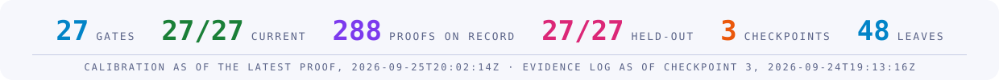
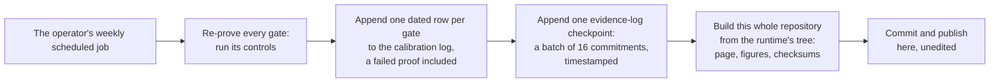

<!-- Built by the Aero Harness runtime from its own tree, and never edited here: the next build replaces any edit. -->
<p align="center">
  <picture>
    <source media="(prefers-color-scheme: dark)" srcset="assets/mark-dark.svg">
    
  </picture>
</p>

<p align="center">
  <picture>
    <source media="(prefers-color-scheme: dark)" srcset="assets/title-dark.svg">
    
  </picture>
</p>

<p align="center">
  <strong>The calibration record and evidence log of the Aero Harness: the inspection software that Ashforde OÜ, a private limited company (osaühing) in Tallinn, Estonia, runs over engineering work.</strong><br>
  Published so that anyone relying on a record the Aero Harness issued can check the instrument behind it, rather than take its operator's word.
</p>

<p align="center">
  <picture>
    <source media="(prefers-color-scheme: dark)" srcset="assets/statline-dark.svg">
    
  </picture>
</p>

<p align="center">
  <a href="#calibration"></a>
  <a href="calibration/log.csv"></a>
  <a href="#held-out-controls"></a>
  <a href="log/"></a>
  <a href="#timestamps"></a>
</p>
<p align="center">
  <a href="LICENSE"></a>
  <a href="verify/"></a>
  <a href="#about-ashforde-oü"></a>
  <a href="https://github.com/ashfordeOU/aero-harness-records/actions/workflows/verify.yml"></a>
</p>

<p align="center">
  <a href="#verify-them-yourself">Verify</a> ·
  <a href="#calibration">Calibration</a> ·
  <a href="#held-out-controls">Held-out controls</a> ·
  <a href="#evidence-log">Evidence log</a> ·
  <a href="#what-these-records-do-not-say">What they do not say</a> ·
  <a href="#frequently-asked-questions">Questions</a> ·
  <a href="#glossary">Glossary</a> ·
  <a href="#licence">Licence</a>
</p>

---

**What this is.** The Aero Harness is inspection software. It runs a fixed,
versioned set of automated checks over engineering work and issues a signed
record of what they found. Ashforde OÜ builds and operates it, and keeps the
software private. This repository is public, and it holds what Ashforde OÜ
records about the software itself:

- **the calibration record**: for each of the software's automated checks,
  called *gates*, every dated proof that the gate could still fail when shown
  the defect it exists to catch, and the published policy for what happens
  when a proof is missed or fails;
- **the evidence log**: an append-only, timestamped log of commitments to the
  records the software issues. The holder of a record can prove from it that
  the record was logged; nobody else can learn anything about the record
  from it.

**Why it may matter to you.** If you work in product assurance, you keep
this kind of record for your own inspection, measuring and test equipment:
proven capable before use, rechecked at intervals, and earlier results
reassessed when an item is found out of tolerance. The quality assurance
standard of the European Cooperation for Space Standardization (ECSS),
ECSS-Q-ST-20C Rev. 2, asks for that in clause 5.2.6, on metrology and
calibration, and names test software beside hardware. These are those
records, kept for a piece of test software. If you hold a record the Aero
Harness issued, this repository lets you check that the gates behind it were
in calibration when it was issued and that it is in the log, with Python
alone and nothing from the runtime: two short scripts published here, which
you can read, or your own, written from the format documented below. The
comparison with the standard is the operator's own; nobody has assessed it.

Every file here is built by the runtime from its own tree, and nothing is
edited by hand. A scheduled job on the operator's machine rebuilds and
commits the set every week; the earliest commits here were made by hand,
from the same build. The states on this page are as of the latest proof on
record, **2026-09-24T18:21:31Z**. A page cannot know when it is read, so for a gate's
state today, run `python3 verify/gate_states.py`, which applies the
published policy to the log at the moment you run it.

## Contents

- [What these records are](#what-these-records-are) · [Why they are public](#why-they-are-public) · [How they are produced](#how-they-are-produced)
- [Verify them yourself](#verify-them-yourself) · [Check a record we issued](#check-a-record-we-issued) · [Calibration](#calibration) · [Held-out controls](#held-out-controls) · [Evidence log](#evidence-log)
- [What these records do not say](#what-these-records-do-not-say) · [Report a discrepancy](#report-a-discrepancy) · [Repository layout](#repository-layout)
- [Frequently asked questions](#frequently-asked-questions) · [Glossary](#glossary) · [Citing](#citing) · [Licence](#licence) · [About Ashforde OÜ](#about-ashforde-oü) · [Related repositories](#related-repositories)

## What these records are

A dated statement by the operator about its own inspection instrument,
published so that it can be checked rather than trusted. It has three parts,
and a verifier:

| Part | Files | What it states |
|---|---|---|
| The policy | [`CALIBRATION.md`](CALIBRATION.md) | how often every gate must be proven able to fail, what "current", "stale", "lapsed" and "out of tolerance" mean, and what happens to records already issued when a proof fails |
| The calibration record | [`calibration/registry.csv`](calibration/registry.csv), [`calibration/log.csv`](calibration/log.csv) | every gate with its interval and its controls; every proof ever run against a gate, dated, a proof that failed included |
| The evidence log | [`log/leaves.txt`](log/leaves.txt), [`log/checkpoints.jsonl`](log/checkpoints.jsonl) | append-only commitments to the records the runtime issues, in weekly checkpoints, each timestamped by an independent authority when one answers |
| The verifier | [`verify/`](verify/) | three short Python scripts, using nothing but Python's standard library, that check what is here against the published sums, check the log, and compute each gate's state without anything from the runtime; published under the Apache License, Version 2.0 (Apache-2.0) |

A **gate** is one of the runtime's automated checks, and it must pass. It
*goes red*, that is fails, when the defect it exists to catch is present. A
gate's **control** is the procedure that proves it still can: it plants
known defects in front of the gate and requires the gate to name each one.
Running every control and writing down the outcome, with the instant, is
**calibrating** the gate: the idea of calibrating a gauge, applied to
software that inspects engineering work. Each gate is listed under
[Calibration](#calibration) with a line saying what it checks.

The records the runtime issues are **conformance claims**: signed documents,
in the format defined by the Agent Run Conformance Specification,
number 1 (ARCS-1), each saying which checks were run, by which version of
the runtime, over exactly which content, and for which period. No record is
published here. The evidence log holds only commitments to them, from which
nothing about a record can be learnt without the record in hand.

These records are published under Creative Commons Attribution 4.0
International (CC BY 4.0), and the verifier under Apache-2.0; see
[Licence](#licence).

## Why they are public

A calibration record that only its keeper can read is not a record anybody
else can rely on. The runtime can stay private; what it says about itself
cannot, or it is the operator's word and nothing more.

Publishing makes the record hard to rewrite quietly. Every proof is appended
to `calibration/log.csv` and never removed, and the policy says so. Every
week the whole set is rebuilt and committed here, so the history of this
repository is a public custody trail: a row removed or changed after it was
published shows as a change to anyone who compares the history, or who holds
an earlier clone. The date on a commit is the committer's own statement; the
only dates here that an independent party vouches for are the timestamps on
the evidence log's checkpoints.

The policy was fixed in the runtime's own history before the first proof was
run, at 2026-09-21T22:13:19Z, and published here with the first proofs. The
runtime's history is private, so that order rests on the operator's word.
What anyone can check is that every change to the policy since is in this
repository's history, and that the policy numbers its versions.

## How they are produced



Nothing in this repository is edited by hand. The runtime writes the set,
and its own checks hold this repository to what it builds, byte for byte and
in both directions: a file missing, a file that differs, a file nobody
built, or a symbolic link where a file should be is a finding, and the copy
is not current until it is rebuilt. [`SHA256SUMS`](SHA256SUMS) names the digest of
every other file under SHA-256 (Secure Hash Algorithm, 256-bit), so a clone
can be checked against the commit it came from.

The runtime itself is private, and some sentences in `CALIBRATION.md` and
in the comment lines of `calibration/registry.csv` name files, commands and
settings inside it: `docs/…`, `make …`, `tools/…` and the like. Those are
references to the runtime's own tree, which you cannot open; everything
these records need in order to be checked is here. The files they name that
are published here, under other names:

- `docs/CALIBRATION.md` is [`CALIBRATION.md`](CALIBRATION.md)
- `records/calibration-log.csv` is [`calibration/log.csv`](calibration/log.csv)
- `contract/calibration.csv` is [`calibration/registry.csv`](calibration/registry.csv)

## Verify them yourself

Nothing needs installing beyond Python 3.9 or later and a SHA-256 tool, and
none of the checks uses the network.

**1. Every file is the one that was published, and nothing else is here.**

```sh
shasum -a 256 -c SHA256SUMS        # or: sha256sum -c SHA256SUMS
python3 verify/verify_files.py .
```

Each line of the first should end `OK`. A file that differs is not the file
this commit published, and a file that is missing is named.

The first command walks the list inside `SHA256SUMS` and never this
directory, so it cannot see a file nobody listed: a script or a note added
to a clone passes it. The second walks the directory and names every file
`SHA256SUMS` does not. The two together say: these files, with these
contents, and no others.

**2. The evidence log holds together.**

```sh
python3 verify/verify_log.py log/
```

It recomputes every checkpoint's root from `log/leaves.txt`, and checks that
each checkpoint adds exactly one sorted batch of 16 leaves, that each
names the digest of the one before it, that each consistency proof shows its
tree extends the previous one, and that each timestamp token stamps its
checkpoint's digest. It ends `PASS` or lists every finding; it exits 0 when
the log holds, 1 on a finding, and 2 when it cannot run at all, for example
when a file is missing. It was written from the format documented
[below](#evidence-log), not from the runtime, and it states what it does not
check.

**3. Each gate's state today.**

```sh
python3 verify/gate_states.py                          # at this moment
python3 verify/gate_states.py --at YYYY-MM-DDTHH:MM:SSZ   # at any instant
```

It reads the interval and the grace from the sentences of `CALIBRATION.md`
itself, each gate's interval from the registry, and every proof from the
log, and applies the rules in [Calibration](#calibration). It exits 1 if any
gate is lapsed or out of tolerance at that instant, and 2 if the policy no
longer states a figure in the sentence it reads, rather than guess.

**4. A record is in the log.**

```sh
python3 verify/verify_log.py log/ --record your-record.json
```

It computes the record's commitment from its `record_id` and the salt it
carries, finds it under the latest checkpoint, and prints an inclusion proof
checked against that checkpoint's root. Everything happens on your machine.

To try it on a published record: ARCS-1 is published with a specimen,
a record issued only to show the format, and the specimen was committed
to this log at checkpoint 3. These two commands download it from Aero Agent
Skills, Ashforde OÜ's public library of aerospace engineering knowledge
packaged as skills for software agents, where ARCS-1 is published, and
prove it is in this log:

```sh
curl -sLO https://raw.githubusercontent.com/ashfordeOU/aero-agent-skills/main/spec/specimen/aero-capability-dossier.json
python3 verify/verify_log.py log/ --record aero-capability-dossier.json
```

**5. The gates behind a record were in calibration when it was issued.**

```sh
python3 verify/gate_states.py --record your-record.json
```

A record carries its **calibration annex** in `provenance.calibration`: the
state of every gate at the instant it was issued, as the runtime computed it
then. This applies the published policy to the published log at the record's
`issued_at` and says, gate by gate, whether the two agree. It exits 0 when
they all do and 1 when any does not. A record issued before the runtime
began writing the annex has none, the published specimen among them: the
script then prints `NOT CHECKED`, says why, and exits 2, which is not a
finding against the record. If the annex and the log disagree, report it
privately, as [`SECURITY.md`](SECURITY.md) says: the output names the
instant the record was issued, which ties you to it.

### Timestamps

When a checkpoint of the evidence log is made, its digest is sent to a
time-stamping authority (TSA): an independent service that signs a statement
that a given digest existed at a given time. Whether one answered is stated
in the checkpoint's `timestamp` field (see [the two files](#the-two-files)).
The statement, a timestamp token, follows RFC 3161 (Request for Comments 3161,
*Internet X.509 Public Key Infrastructure Time-Stamp Protocol*; X.509 is the
standard format of public-key certificates). `verify_log.py` reads each token far enough to
check that it stamps that checkpoint's digest, and that its time is the
`time` the checkpoint records. It does not check the authority's signature
or its certificate chain: that needs X.509 certificates and the RSA
(Rivest–Shamir–Adleman) or ECDSA (Elliptic Curve Digital Signature
Algorithm) signature schemes, which Python's standard library does not
have. To check them with OpenSSL, the widely used open-source cryptography
toolkit:

```sh
tokens="$(mktemp -d)"
python3 verify/verify_log.py log/ --export-tokens "$tokens"
```

For each stamped checkpoint this writes the token to a file and prints the
command that checks it, of the form:

```sh
openssl ts -verify -digest <checkpoint digest> -in "$tokens/checkpoint-3.tst" -token_in \
  -CAfile <your trusted root certificates>
```

It prints `Verification: OK` when the signature holds and chains to one of
the root certificates in the file you name, which are your trust anchors: on
most Linux systems `/etc/ssl/certs/ca-certificates.crt`, on macOS
`/etc/ssl/cert.pem`. Use OpenSSL 3. LibreSSL, the variant of OpenSSL that
macOS installs as `/usr/bin/openssl`, did not build the chain when the
operator tried it.

## Check a record we issued

The checks above are about *these records*. A record the instrument issued to
somebody — a sealed dossier — is checked with a different thing: the offline
verifier kit, published on this repository's
[releases page](https://github.com/ashfordeOU/aero-harness-records/releases). Each release names its own archive and
digest, so this section names neither: a digest repeated in prose is a copy,
and a copy drifts.

The kit is a directory you copy and run with nothing but a Python
interpreter: no network, no account, nothing to install. It checks the seal and re-derives
what the record states, answering AGREE or DISAGREE for each check, with a
check that did not run never counted as one that passed. It bundles two
records to check itself against — a genuine one that must come back AGREE and
the same record with one figure changed after signing, which must come back
DISAGREE. A verifier that agrees with both is not checking anything.

**What an AGREE is worth.** It says the record was signed by the key you
anchored. It says nothing about how well that key is looked after. Ours today
is a software key: one file on one machine, held by one person, with no
hardware token, no witnessed generation ceremony, no escrow copy, and no
second person able to act if the holder is unavailable. That sentence is
inside the kit too, and it changes when the ceremony is performed and its log
published, not before.

## Calibration

The policy is [`CALIBRATION.md`](CALIBRATION.md). In short: every gate is
re-proven able to fail at least every **30 days**, whether or not
anything changed, and after that there is a **7-day** grace. Every
proof is appended to [`calibration/log.csv`](calibration/log.csv), a proof
that fails included. At any instant each gate is in exactly one
calibration state, and the policy defines them in these words:

> - `current` — the last proof went red where it should, and is no older than the interval. Records may be issued.
> - `stale` — the last proof is past the interval but inside the grace. Records may still be issued, and each one says which gates were stale when it was issued and since when. Nothing is withdrawn: the equipment was not found wrong, only not yet re-checked.
> - `lapsed` — the last proof is past the interval and the grace, or there has never been one. **No record may be issued** that depends on the gate until it is proven again. Records issued earlier stand, because nothing has shown them wrong; the lapse is recorded against the date it began.
> - `out-of-tolerance` — the most recent proof did **not** go red where it should have. The equipment is found unable to detect what it was proven to detect. That is the `harness-defect` trigger of `docs/COUNTERMAND.md`, and the section below on what a failed proof does to records already issued applies.

The quotation is exact, so its references are the policy's own: "below"
means further down `CALIBRATION.md`; `docs/COUNTERMAND.md` is the runtime's
countermand policy (how records already issued are withdrawn or replaced,
by a signed status list); and `harness-defect` is that policy's name for a
gate that reported on something it did not check.

### Each gate as of the latest proof

State of each gate **as of the latest proof on record, 2026-09-24T18:21:31Z**; for a
gate's state today, run `python3 verify/gate_states.py`. Each gate's
controls are named as the registry names them (see
[Reading the registry](#reading-the-registry)).

| gate | what it checks | state at 2026-09-24 | last proven | proofs | interval | controls |
|---|---|---|---|---:|---:|---|
| `gate-version` | The runtime's three version labels — its own version, the edition of the specification it implements, and the format of the claims it issues — are each well formed. | current | 2026-09-24T18:21:31Z | 11 | 30 days | `plants` + `heldout` |
| `gate-workorder` | Every item of work this operator has taken on is listed in one register, each with the state it is in and, where it is unfinished, the named act it is waiting on and who has to perform it. Work that depends on somebody outside this company is recorded as waiting on that person, and is never recorded as finished. | current | 2026-09-24T18:21:31Z | 6 | 30 days | `suite` + `heldout` |
| `gate-claims` | Every figure the runtime's own documentation states, such as how many tests or gates there are, is recounted from the source and agrees. | current | 2026-09-24T18:21:31Z | 12 | 30 days | `suite` + `heldout` |
| `gate-qualification` | The kit that says what this tool has to do, and how each of those was checked, still describes the whole tool: every check the runtime runs is named in it, and a check added without being placed there is refused. The kit states what the tool is known not to do, each limitation naming the act that would end it, and no sentence in it claims that anybody outside this company has accepted the tool for use. Nobody has, and the sentence shapes that would claim it are refused here and everywhere else this operator writes. | current | 2026-09-24T18:21:31Z | 4 | 30 days | `suite` + `heldout` |
| `gate-identifiers` | Published requirement and objective numbers from more than one standards family can be carried by a record. For one family a free export of every requirement exists, so a citation either resolves against a list a reader builds from their own copy or is reported as not found. For the others no such list exists that this operator can hold, so a citation is checked for shape, carried exactly as it was written, and kept in a separate count that is never added to the first. No file anywhere in the runtime holds a sentence of a published standard: the words belong to the body that issued them, and this check reads every file for them. | current | 2026-09-24T18:21:31Z | 4 | 30 days | `suite` + `heldout` |
| `gate-spec` | The published specification, ARCS-1, still describes what the runtime does: its field tables, its test vectors and its worked example all match the code. | current | 2026-09-24T18:21:31Z | 11 | 30 days | `suite` + `heldout` |
| `gate-spec-mirror` | The public copy of the specification is exactly what the runtime builds, byte for byte, with nothing missing and nothing extra. | current | 2026-09-24T18:21:31Z | 11 | 30 days | `suite` + `heldout` |
| `gate-records-mirror` | This repository is exactly what the runtime builds, byte for byte, with nothing missing and nothing extra. | current | 2026-09-24T18:21:31Z | 10 | 30 days | `suite` + `heldout` |
| `gate-countermand` | The published policy for withdrawing records already issued still matches the code that withdraws them, with a deadline for every trigger. | current | 2026-09-24T18:21:31Z | 11 | 30 days | `suite` + `heldout` |
| `gate-copy` | No sentence the runtime shows a customer asks them to trust a machine-learning model in place of the deterministic checks; the refused phrasings are kept as data, each with an example it must catch. | current | 2026-09-24T18:21:31Z | 11 | 30 days | `suite` + `heldout` |
| `gate-retired` | A name the operator has retired appears in no file and no path, in any spelling: upper or lower case, written as a character reference, or broken by a character that takes no room on the page. The name is kept only as a digest, so the list of retired names is not itself a place it survives, and the new name must be found, so a check that read the wrong files cannot pass. | current | 2026-09-24T18:21:31Z | 3 | 30 days | `suite` + `heldout` |
| `gate-family` | The repositories this operator publishes are described in one place and rendered everywhere else. Every connection between them names the check that goes red when its pin breaks, and that name is resolved against the runtime, so a check cannot be renamed while the map describing it stays still. Every abbreviation a stranger meets in a public file is spelled out at its first use, or carries a written reason why it need not be. | current | 2026-09-24T18:21:31Z | 6 | 30 days | `suite` + `heldout` |
| `gate-governance` | The runtime's governance document is consistent: every asset it lists is assigned to exactly one party, and none to a party the document says may not hold it. | current | 2026-09-24T18:21:31Z | 11 | 30 days | `suite` + `heldout` |
| `gate-calibration` | Every gate has a good proof no older than its interval and grace, and no gate's latest proof failed: the policy on this page, applied inside the runtime. | current | 2026-09-24T18:21:31Z | 7 | 30 days | `suite` + `heldout` |
| `gate-isolation` | The runtime's source names no particular corpus, so the content it inspects can change without the inspection software changing. | current | 2026-09-24T18:21:31Z | 11 | 30 days | `suite` + `heldout` |
| `gate-manifest` | The runtime's declared list of its own parts matches its files both ways: nothing declared is missing, and nothing present is undeclared. | current | 2026-09-24T18:21:31Z | 11 | 30 days | `suite` + `heldout` |
| `gate-contract` | The documents the runtime loads on every run are usable, not merely present: an empty or unreadable one is a finding. | current | 2026-09-24T18:21:31Z | 11 | 30 days | `suite` + `heldout` |
| `gate-imports` | The runtime uses nothing but Python's standard library and its own code, so no check depends on a third-party package or a network service. | current | 2026-09-24T18:21:31Z | 11 | 30 days | `suite` + `heldout` |
| `gate-shadow` | No file in the runtime is named after a module of Python's standard library, which would silently stand in for that module. | current | 2026-09-24T18:21:31Z | 11 | 30 days | `suite` + `heldout` |
| `gate-sandbox` | Every permission granted to a program the runtime starts is enforced by the operating system, shown by running programs that try to exceed it. | current | 2026-09-24T18:21:31Z | 11 | 30 days | `script` + `suite` + `heldout` |
| `gate-membrane` | Material that only suggests what might be true is never counted as evidence: before any run starts, such material is planted in a throwaway copy of the evidence store, and both the check that traces evidence to its source and the step that merges findings must refuse it and name it as advice, each judged on its own. | current | 2026-09-24T18:21:31Z | 11 | 30 days | `script` + `suite` + `heldout` |
| `gate-reviewer` | The review step is independent of the work it reviews, and its code still does what its written specification says. | current | 2026-09-24T18:21:31Z | 11 | 30 days | `plants` + `heldout` |
| `gate-provenance` | A quotation in the evidence for a finding matches, exactly, something the runtime archived, and output the runtime captured itself is never reported as material somebody handed it. | current | 2026-09-24T18:21:31Z | 11 | 30 days | `script` + `heldout` |
| `gate-heldout` | No change has ever moved a gate and its held-out control together, and, when the controls are handed to it, each matches the SHA-256 digest it is pinned to. | current | 2026-09-24T18:21:31Z | 11 | 30 days | `plants` + `heldout` |
| `gate-swap` | The software that produces the work under inspection can be replaced by changing one line, and nothing else in the runtime changes. | current | 2026-09-24T18:21:31Z | 11 | 30 days | `suite` + `heldout` |
| `gate-bindings` | Every skill a role says it relies on exists in the skills library the role is paired with. | current | 2026-09-24T18:21:31Z | 11 | 30 days | `plants` + `heldout` |
| `gate-permissions` | The tools each role asks for and the most the runtime ever allows reconcile: a role gets no more than both permit. | current | 2026-09-24T18:21:31Z | 11 | 30 days | `suite` + `heldout` |

**261 proofs on record**, from 22 runs between 2026-09-21T22:13:19Z and 2026-09-24T18:21:31Z: 2 out of tolerance, 5 void rows. Every control is written by the operator, so this is
self-calibration, and it is called that: the defects the gates are proven
against are the operator's own choice, and nobody else has approved them.

### Reading the calibration log

`calibration/log.csv` is a table in CSV (comma-separated values) with a
header row, appended to in time order and never rewritten. Its columns:

| column | what it holds |
|---|---|
| `at` | the instant the proof was run, in Coordinated Universal Time (UTC), written `YYYY-MM-DDTHH:MM:SSZ` |
| `gate` | the gate proven |
| `outcome` | what the proof found (below) |
| `runtime` | the runtime's version when the proof was run |
| `environment` | the interpreter and the machine the proof ran on |
| `evidence` | what each control reported, in its own words |
| `output_sha256` | the SHA-256 digest of the controls' full output, which is kept by the operator and not published: it fixes which output the row describes |

The `outcome` column holds one of:

| outcome | what it means |
|---|---|
| `red-capable` | every control ran, and every defect it planted was named: the gate can still go red |
| `out-of-tolerance` | a control ran and a defect it planted was not caught: a failed proof |
| `void` | a control could not run; this is a proof of neither kind, and the gate's last good proof keeps ageing |

A gate's state at an instant follows from its rows dated no later than that
instant. `void` rows are passed over. If the latest remaining row is
`out-of-tolerance`, the gate is out of tolerance. Otherwise its latest
`red-capable` row decides: current while it is no older than the gate's
interval, stale during the grace after that, lapsed from then on, and
lapsed if it has never had one. That is what `verify/gate_states.py` does.

### Reading the registry

`calibration/registry.csv` has a comment header and one row per gate:
`gate`, `interval_days` (at most the policy's interval), and `controls`, a
list separated by `;` of the controls that prove the gate, each written
`kind:target`:

| kind | what proves the gate |
|---|---|
| `suite` | the gate's own test suite, which plants defects in front of the gate and requires findings |
| `script` | a control script that mutates the gate end to end and passes only when every mutant goes red naming its defect |
| `plants` | defects planted in a throwaway copy of the runtime, each of which the gate must name |
| `heldout` | the gate's held-out control, run from a separate repository after its digest is checked against its pin |

## Held-out controls

A control written beside its gate, by the same hand and in the same sitting,
tends to plant exactly the defects the gate already catches. A **held-out**
control plants a different set, and it is frozen: the gate's author may not
adjust it when the gate changes. The runtime refuses any change that moves a
gate and its held-out control together, and keeps the held-out controls in a
repository of their own, each pinned by its SHA-256 digest.

**27 of 27 gates carry one** as of this build.
Every gate is covered; the schedule published for closing the gap (every remaining gate by 2026-11-02) is met.

Held-out controls are written by the operator too. They separate histories,
not people: until controls come from someone else, this is still
self-calibration, and the records say so.

## Evidence log

Commitments to the records the runtime issues, appended and never
rewritten, in [`log/`](log/). **3 checkpoints and 48 leaves; the latest is checkpoint 3, at 2026-09-24T19:13:16Z, root `dd73b04213679c7f91e8626cf83d226a948221cb76a082ce17c9f5fb20067e28`.** 3 of 3 checkpoints carry a timestamp token.

### What a leaf is

A leaf is a commitment, never content: SHA-256 over the bytes of
`aero-evidence-log-leaf/v1`, a zero byte, the record's `record_id` in UTF-8 (the
standard way of writing Unicode text as bytes), a zero byte, and the
32-byte salt the record carries in `provenance.log.salt`. The
salt is an HMAC-SHA-256 (a hash-based message authentication code built on
SHA-256: a hash only the holder of a secret key can compute) of the record's
own content, under a key the operator never publishes, and it is written
into the record when it is issued. So the holder of a record can find its
leaf, and nobody else can: a record's serial (its `record_id`, the
identifier that appears on it) seen elsewhere cannot be looked up in the log
without the salt only the record carries. This is the log's blinding.

### What the log's shape reveals

Nothing about how many records were issued, by construction. Leaves are
appended only in batches of exactly **16**, one batch per checkpoint,
on the operator's weekly cadence. Each batch is padded with dummy leaves,
derived from the operator's key so that they cannot be told from real
commitments without it, and sorted by value, so position says nothing
about order of issue. The log's size says how many weeks it has run.

A record is queued when it is issued, and each checkpoint takes at most one
batch from the queue, so a record appears at the first checkpoint with room
for it.

### The tree

The leaves form a Merkle tree, a tree of hashes in which each node is the
hash of the two below it, so that one value at the top, the root, fixes
every leaf. It is the tree of RFC 6962 (Request for Comments 6962,
*Certificate Transparency*), as RFC 9162
(*Certificate Transparency Version 2.0*) restates it in section 2.1: the
hash of a leaf is SHA-256(0x00 ‖ leaf) and the hash of a node is
SHA-256(0x01 ‖ left ‖ right), where ‖ joins bytes end to end. An inclusion proof
shows that a leaf is in a tree of a given size and root; a consistency proof
shows that a later tree extends an earlier one without altering it, which is
what catches a leaf inserted into history that had already been published.

### The two files

`log/leaves.txt` holds one leaf per line, in log order: 64 lowercase
hexadecimal characters and a newline. `log/checkpoints.jsonl` holds one
checkpoint per line, each an object in JSON (JavaScript Object Notation),
with these fields:

| field | what it holds |
|---|---|
| `context` | always `aero-evidence-log-checkpoint/v1` |
| `sequence` | one for the first checkpoint, and one more for each after it |
| `tree_size` | how many leaves the checkpoint covers: 16 times its sequence |
| `root` | the tree's root over those leaves, hexadecimal |
| `at` | the instant the operator states for the checkpoint, in UTC |
| `batch` | the batch size, 16 |
| `previous` | the digest of the checkpoint before it (below), or null for the first |
| `status_list` | the SHA-256 digest of the signed status list in force when the checkpoint was made, or null; the list states which issued records have been superseded or withdrawn (their standing), and is not published here |
| `consistency_from_previous` | the RFC 9162 consistency proof from the previous checkpoint's tree to this one, as hexadecimal hashes; empty for the first |
| `timestamp` | the timestamp over the checkpoint's digest (below) |

A checkpoint's **digest** is SHA-256, in hexadecimal, over its JSON with the
`timestamp` field left out (and an `attestation` field, the issuer's
signature, should a checkpoint ever carry one), serialised with the keys
sorted, `,` and `:` as separators and no other whitespace, and characters
beyond ASCII (the American Standard Code for Information Interchange)
written as UTF-8 rather than escaped. It is what the next checkpoint's
`previous` names and what the timestamp token stamps.

The `timestamp` field is an object whose `state` is one of:

| state | what it means |
|---|---|
| `stamped` | an RFC 3161 token from the authority named, which verified when it arrived |
| `unavailable` | every authority asked was unreachable or answered with a token that did not verify; each is listed with its reason, and the checkpoint stands on its own `at` |
| `not_requested` | no authority was asked, and the field says so rather than being left out |

A stamped checkpoint's `timestamp` also carries `authority`, the web address
(URL) of the time-stamping authority; `time`, the time in its token;
`qualified`, whether that authority's service held qualified status, on the
trusted list the operator reads, under the European Union's regulation on
electronic identification and trust services (eIDAS), at that time; and
`token`, the RFC 3161 token itself, in DER (Distinguished Encoding Rules,
the standard binary encoding of such structures) written as Base64 text. A
timestamp says when the checkpoint existed. It says nothing about whether
anything the log commits to is right.

### What the verifier checks

For checkpoint *n*, counting from one, `verify/verify_log.py` checks that its
`context` is `aero-evidence-log-checkpoint/v1` and its `sequence` is *n*; that its `batch` is
16 and its `tree_size` is *n* × 16; that its `root` is the root
of that many leaves; that the batch it added is sorted; that `previous` is
the digest of checkpoint *n* − 1, or null for the first; that
`consistency_from_previous` proves its tree extends the previous one, and is
empty for the first; that `at` is an instant no earlier than the previous
checkpoint's; and, when stamped, that the token stamps the checkpoint's
digest and states its `time`. Last, that `log/leaves.txt` holds exactly as
many leaves as the last checkpoint covers. It does not check the token's
signature (see [Timestamps](#timestamps)) or the status list a checkpoint
names, which is not published here.

## What these records do not say

- **They are not a certification.** Nobody has certified, approved or
  qualified the Aero Harness, and nothing here says otherwise. A proof in
  this log is the operator's evidence about its own equipment; a gate being
  current is evidence, not certification.
- **They are self-calibration.** Every control is written by the operator.
  The held-out controls are kept apart from the gates by history and by
  repository, not by person.
- **A current gate is not a correct conclusion.** A gate proven able to fail
  caught the defects its controls planted, on the day of the proof. That
  says nothing about defects no control plants, and nothing about whether any
  engineering conclusion in an issued record is right.
- **A record's content is never here.** The log holds commitments only. It
  says nothing about what was assessed, for whom, or how many records there
  are.
- **You cannot re-run the controls.** The runtime and its controls are
  private. What you can check is that the records agree with themselves and
  with the published policy, that the log's history holds, that its
  timestamps are genuine, and that this repository's history, compared with
  an earlier clone, shows no rewrite. The `output_sha256` column fixes which output a proof produced,
  without publishing it.
- **The states on this page are as of the latest proof**, not as of the day
  you read it.

## Report a discrepancy

If the records disagree with themselves, with the published policy, or with
what a command above prints, that is worth reporting, and it is why they are
public.

- **In the open**, for anything that reveals nothing private: the
  [discrepancy form](https://github.com/ashfordeOU/aero-harness-records/issues/new/choose)
  asks for the commit you checked, the command you ran and its output, and
  what you expected. A question, or an improvement to the verifier, has a
  form of its own beside it.
- **In private**, for a record you hold, a way to defeat the checks above, or
  anything else that should not be public: email **contact@ashforde.org**
  with "RECORDS" in the subject. [`SECURITY.md`](SECURITY.md) has the
  detail. Never post a record, its serial, its salt or the instant it was
  issued in a public issue.

What happens next is what the published policies say, and no more. A report
that shows a gate could not detect what its proof says it detected is a
failed proof, and `CALIBRATION.md`, in "What a failed proof does to records
already issued", says what follows. A discrepancy in the records themselves
is fixed at its source in the runtime, and the fix arrives here in the next
build; nothing already in the calibration log is deleted
([`CONTRIBUTING.md`](CONTRIBUTING.md)).

## Repository layout

| file | what it is |
|---|---|
| [`README.md`](README.md) | this page, generated from the records |
| [`CALIBRATION.md`](CALIBRATION.md) | the calibration and lapse policy, as the runtime holds it |
| [`calibration/registry.csv`](calibration/registry.csv) | every gate, its interval and its controls |
| [`calibration/log.csv`](calibration/log.csv) | every dated proof, appended and never rewritten |
| [`log/leaves.txt`](log/leaves.txt) | the evidence log's leaves, one per line, in log order |
| [`log/checkpoints.jsonl`](log/checkpoints.jsonl) | the evidence log's checkpoints, one per line |
| [`verify/verify_files.py`](verify/verify_files.py) | checks that every file here is one `SHA256SUMS` names and that nothing else is here (Apache-2.0) |
| [`verify/verify_log.py`](verify/verify_log.py) | checks the evidence log from its two files (Apache-2.0) |
| [`verify/gate_states.py`](verify/gate_states.py) | each gate's state at any instant, by the published policy, and a record's calibration annex against the log (Apache-2.0) |
| [`family.json`](family.json) | the family of repositories and what connects them, as data, for a page that draws the family; a private repository is described and never named |
| [`assets/`](assets/) | the figures on this page, drawn from the records as SVG (Scalable Vector Graphics) images, light and dark: `mark-dark.svg`, `mark.svg`, `statline-dark.svg`, `statline.svg`, `title-dark.svg`, `title.svg` |
| [`SHA256SUMS`](SHA256SUMS) | the SHA-256 digest of every other file, for `shasum -a 256 -c` |
| [`LICENSE`](LICENSE) | the licence of the records, CC BY 4.0: its official legal code |
| [`LICENSES/Apache-2.0.txt`](LICENSES/Apache-2.0.txt) | the licence of the verifier, Apache-2.0: its official text |
| [`LICENSING.md`](LICENSING.md) | which licence covers which file, in plain language |
| [`NOTICE`](NOTICE) | copyright, licences and attribution in one place |
| [`CITATION.cff`](CITATION.cff) | how to cite the records, in the Citation File Format |
| [`SECURITY.md`](SECURITY.md) | how to report an integrity problem privately |
| [`CONTRIBUTING.md`](CONTRIBUTING.md) | why there are no pull requests, and what to do instead |
| [`CODE_OF_CONDUCT.md`](CODE_OF_CONDUCT.md) | the Contributor Covenant, version 2.1 |
| [`.github/`](.github/) | the issue forms, the pull-request notice, and the workflow that runs the checks above on every push and every week: `ISSUE_TEMPLATE/config.yml`, `ISSUE_TEMPLATE/discrepancy.yml`, `ISSUE_TEMPLATE/question.yml`, `PULL_REQUEST_TEMPLATE.md`, `workflows/verify.yml` |
| [`.gitattributes`](.gitattributes) | tells git to check every file out byte for byte, so `SHA256SUMS` holds on every platform |
| [`.ci-native`](.ci-native) | the checks above, run on the operator's own machine before anything is pushed here, so a set that does not verify never reaches this page |
| [`.ci-policy`](.ci-policy) | the identity every commit here must carry |

## Frequently asked questions

**I have never heard of Ashforde OÜ. Who is behind this?**
A private limited company registered in Estonia, which builds and operates
the Aero Harness. Its registration, address and contact are under
[About Ashforde OÜ](#about-ashforde-oü), and can be checked in the Estonian
e-Business Register.

**Is the Aero Harness certified, and are these records a certification?**
No, and no. Nobody has certified, approved or qualified the runtime. The
records are the operator's own evidence about its own equipment, published
with a custody trail so that they can be checked. See
[What these records do not say](#what-these-records-do-not-say).

**What does a gate actually check?**
Each checks one property of the runtime that must always hold, stated in a
line beside its name in the
[calibration table](#each-gate-as-of-the-latest-proof): that a published
document still says what the code does, that a permission is enforced by the
operating system, that nothing the runtime depends on is a third-party
package, and so on. A gate either finds its defect or it does not; there is
no partial reading.

**Why should I believe that a proof in the log was actually run?**
You cannot re-run it: the runtime is private. What you can rely on is that
the log is dated, appended every week and published here, where its history
is public; that the policy it answers to was fixed before its first row and
published with it; and that a row changed after publication would show in
this repository's history to anyone who compares it with an earlier clone.
That is the weight of a custody trail, and not more.

**Can I tell from the log how many records Ashforde OÜ has issued?**
No. Every checkpoint adds exactly 16 leaves, padded with dummy leaves
and sorted, whatever was issued that week. The log's size says how many
weeks it has run.

**My record is not found. What does that mean?**
A record is committed at the first checkpoint with room for it after it is
issued, so a recent record may not be in the log yet. A record issued
without the log carries no salt, and its `provenance.log` says `not_logged`.
If neither explains it, report it privately ([`SECURITY.md`](SECURITY.md)),
never in a public issue.

**What does a timestamp prove?**
That the checkpoint it stamps existed no later than the time in the token,
on the word of an independent time-stamping authority whose signature you
can check yourself ([Timestamps](#timestamps)). It says nothing about
whether anything the log commits to is right.

**Does anything run these checks automatically?**
Yes. The workflow in `.github/workflows/verify.yml` runs the first three
checks under [Verify them yourself](#verify-them-yourself) on every push and
once a week, on GitHub's machines, and the verify badge at the top of this
page shows its latest result. It proves only that the published files agree
with themselves; it cannot see the private runtime.

**What happens when a gate lapses or a proof fails?**
`CALIBRATION.md` says. In short: a lapsed gate stops the issue of records
that depend on it until it is proven again, and records issued earlier
stand. A failed proof reaches back to every record that depended on the gate
and was issued since its last good proof: that set is withdrawn under the
countermand policy and regraded, and the standing of each record in it is
stated in a signed status list. A failed proof is a row of the calibration
log like any other, dated and never removed.

**What is ARCS-1?**
The Agent Run Conformance Specification, number 1. It defines what
a conformance claim issued by the runtime is made of, in a format it calls
claim@1 (the conformance claim format, version 1), and how a stranger checks
one without the runtime: its attestation, its trust anchor, its standing.
Its editions are dated clarifications that never change what conforms (the
current one is 2026-09-24); a change to what conforms would be a new
specification, ARCS-2. It is published in Aero Agent Skills — Ashforde OÜ's
public library of aerospace engineering knowledge, packaged as skills that
software agents load when a task needs them — under its own terms, with a
specimen record; a conformance suite for it is published separately. See
[Related repositories](#related-repositories).

**Why CC BY 4.0 for the records and Apache-2.0 for the verifier?**
CC BY 4.0 is written for data and prose, and covers the database right as
well as copyright; Apache-2.0 is written for code, and carries a patent
grant. [`LICENSING.md`](LICENSING.md) says which covers which file.

**May I mirror or republish these records?**
Yes, under CC BY 4.0: attribute them to "Ashforde OÜ, Aero Harness operator
records" with a link, and say if you changed anything. Keep `SHA256SUMS`
with them, so a reader of your copy can tell whether it is intact.

**Why are there no pull requests?**
Every file is generated and held to its source byte for byte, so a changed
file would be put back by the next build. Report the discrepancy instead,
and the fix is made at the source ([`CONTRIBUTING.md`](CONTRIBUTING.md)).

## Glossary

Every term of art on this page, in plain words.

| term | meaning |
|---|---|
| **attestation** | A signature over a record by its issuer's key, with what a reader needs to check it. It shows who issued the record and that not a byte of it has changed since. |
| **Base64** | A standard way of writing binary data as plain text, using only letters, digits and a few signs. |
| **batch** | The fixed number of leaves, 16, that every checkpoint adds to the evidence log, whatever was issued that week. |
| **blinding** | Keeping the evidence log from revealing anything about the records it commits to. Each leaf is salted, and each batch is padded with dummy leaves and sorted, so the log shows neither content, nor how many records were issued, nor in what order. |
| **calibration** | Proving that a gate can still fail when it should, by running its control and writing down the dated outcome. It is the idea of calibrating a gauge, applied to a software check. |
| **calibration annex** | The state of every gate at the instant a record was issued, as the runtime computed it then, which the record carries in `provenance.calibration`. `verify/gate_states.py --record` compares it with the published log. |
| **calibration state** | Where a gate stands under the policy at an instant: current, stale, lapsed or out of tolerance. The policy's own definitions are quoted under Calibration. |
| **checkpoint** | A dated statement of the evidence log's size and root, chained to the checkpoint before it and, when an authority answers, timestamped. Each is one line of `log/checkpoints.jsonl`. |
| **commitment** | A hash that stands for a record without revealing anything in it. A record's commitment is its leaf in the evidence log. |
| **conformance claim** | The signed record the Aero Harness issues. It says which checks were run, by which version of the runtime, over exactly which content, for which period, and it is signed by the issuer's key. ARCS-1 defines its format. |
| **consistency proof** | A short list of hashes showing that a later tree begins with an earlier tree, unchanged. It is what exposes a leaf inserted into, altered in or removed from history that was already published. |
| **control** | The procedure that proves a gate can still fail: it plants known defects in front of the gate and requires the gate to name each one. |
| **corpus** | A body of engineering content the runtime inspects, such as a library of skills. A record names a corpus by its hash, so an edited corpus cannot pass as the one that was inspected. |
| **countermand** | The issuer's withdrawal or replacement of records it has already issued, published as a signed status list. The calibration policy calls for one when a proof fails. |
| **custody trail** | A dated, public, append-only history that makes a record hard to change unnoticed: here, the calibration log, the evidence log, `SHA256SUMS` and this repository's commit history. |
| **database right** | The right that European Union law gives the maker of a database over its contents, separate from copyright. CC BY 4.0 licenses it along with the copyright. |
| **digest** | The output of a hash function such as SHA-256: a short value of fixed length that changes completely if one byte of the input changes. |
| **dummy leaf** | A leaf derived from the operator's secret key that cannot be told from a real commitment without that key. Batches are filled up with them, so the log's size says nothing about how many records were issued. |
| **edition** | A dated revision of ARCS-1 that clarifies it and never changes what conforms. A change to what conforms would be a new specification, not a new edition. |
| **evidence log** | The public, append-only log of commitments to the records the runtime issues, in `log/`. It commits to records; it never contains them. |
| **gate** | An automated check in the runtime that must pass. A gate goes red (fails) when the defect it exists to catch is present. |
| **grace** | The 7 days after a gate's interval during which it is stale: records may still be issued, and each says which gates were stale. |
| **held-out control** | A second control for a gate, written apart from it and frozen: the gate's author may not change it when the gate changes, so it tests defects the gate was not tuned to catch. |
| **inclusion proof** | A short list of hashes showing that one leaf is in a tree of a given size and root. `verify/verify_log.py --record` prints one for a record you hold. |
| **interval** | The longest a gate may go between proofs and still be current: at most 30 days. |
| **issuer** | The party whose key signs a record. For the records the Aero Harness issues, that is Ashforde OÜ. |
| **leaf** | One entry of the evidence log: the commitment to one record, or a dummy leaf. `log/leaves.txt` holds one per line. |
| **Merkle tree** | A tree of hashes in which each node is the hash of the two below it, so that one value at the top, the root, fixes every leaf. |
| **mutant** | A copy of a gate, or of what it inspects, with one defect planted on purpose. A control passes only when every mutant makes the gate go red and name the defect. |
| **operator** | The party that runs the Aero Harness and publishes these records: Ashforde OÜ. |
| **proof** | One run of a gate's control, dated, with its outcome: one row of `calibration/log.csv`. Not to be confused with the inclusion and consistency proofs of the evidence log. |
| **qualified** | Said of a time-stamping authority whose service held qualified status under eIDAS when it stamped, on the national trusted list the operator reads. A checkpoint's timestamp says whether it did. |
| **record** | Short for a conformance claim the runtime issues: a signed document. Its content is never published here; only a commitment to it is. |
| **role** | A defined engineering job for a software agent, such as producing a compliance matrix, which names the skills it relies on and the tools it may use. Aero Agent Roles, Ashforde OÜ's public role layer, publishes them. |
| **root** | The single hash at the top of a Merkle tree. It changes if any leaf beneath it changes. |
| **runtime** | The software that runs the gates and issues records: the Aero Harness. It is private. |
| **salt** | A value written into a record when it is issued, computed with a key only the operator holds. Without it a record's leaf cannot be found in the log, so only the holder of the record can find it. |
| **self-calibration** | Calibration against reference defects chosen by the maker of the instrument rather than by an independent party. Every control here is written by the operator, so these records are self-calibration, and they say so. |
| **serial** | A record's identifier, its `record_id`: derived from the record's own content, never assigned, and the value that appears on the record. A serial alone cannot be looked up in the evidence log. |
| **skill** | A packaged piece of engineering knowledge that a software agent loads when a task needs it. Aero Agent Skills publishes them. |
| **specimen** | A record issued only to show the format, marked as a specimen and signed with a key kept apart from real ones. ARCS-1 publishes one. |
| **standing** | Whether a record already issued is still in force: in good standing, superseded by a later record, or withdrawn. The issuer states it in a signed status list, never in the record itself. |
| **status list** | A signed list in which the issuer states which of its records have since been superseded or withdrawn. Each checkpoint names the digest of the list in force when it was made; the list is not published here. |
| **symbolic link** | A file that only points to another file. A copy made of links would read correctly on the machine that made it, and publish nothing. |
| **test vector** | A published input together with its one correct output, against which any implementation can be checked. |
| **timestamp token** | A signed statement by a time-stamping authority that a given digest existed at a given time, in the format RFC 3161 defines. |
| **trust anchor** | A key or root certificate that the reader, not the document being checked, has decided to trust. A signature proves something only when it leads back to an anchor the reader chose. |

### Abbreviations and names

Every abbreviation, standard number and code-name on this page, spelled
out.

| short form or name | stands for |
|---|---|
| Aero Agent Roles | Ashforde OÜ's public role layer, which binds Aero Agent Skills into end-to-end engineering deliverables |
| Aero Agent Skills | Ashforde OÜ's public library of aerospace engineering knowledge, packaged as skills that software agents load when a task needs them; ARCS-1 is published in it |
| Aero Harness | Ashforde OÜ's inspection runtime: the software that runs the gates and issues records. It is private |
| Apache-2.0 | the Apache License, Version 2.0, the licence of the verifier |
| ARCS | the Agent Run Conformance Specification |
| ARCS-1 | the Agent Run Conformance Specification, number 1: the published format of the conformance claims the Aero Harness issues, and how anyone checks one. Its editions are dated clarifications that never change what conforms (the current one is 2026-09-24) |
| ARCS-2 | the name a second Agent Run Conformance Specification would take: a change to what conforms under ARCS-1 is not an edition of it but a new specification. There is none |
| ASCII | American Standard Code for Information Interchange: the basic Latin letters, digits and punctuation |
| CC BY 4.0 | Creative Commons Attribution 4.0 International, the licence of the records |
| claim@1 | the conformance claim format defined by ARCS-1, version 1 |
| CSV | comma-separated values: a plain-text table, one row per line |
| DER | Distinguished Encoding Rules: the standard binary encoding of signed structures such as timestamp tokens |
| ECDSA | Elliptic Curve Digital Signature Algorithm, a public-key signature scheme |
| ECSS | European Cooperation for Space Standardization: the body that publishes Europe's space engineering and product assurance standards |
| ECSS-Q-ST-20C | the quality assurance standard of the European Cooperation for Space Standardization |
| eIDAS | electronic identification, authentication and trust services: the European Union's regulation, Regulation (EU) No 910/2014 |
| EU | European Union |
| HMAC-SHA-256 | a hash-based message authentication code built on SHA-256: a hash that only the holder of a secret key can compute |
| JSON | JavaScript Object Notation: a plain-text format for structured data |
| LibreSSL | a variant of OpenSSL, installed by macOS in its place |
| OpenSSL | the widely used open-source cryptography toolkit, whose command-line tool checks timestamp tokens. It is a name and stands for no words |
| OÜ | osaühing: a private limited company under Estonian law |
| RFC | Request for Comments: the series in which Internet standards are published |
| RFC 3161 | Internet X.509 Public Key Infrastructure Time-Stamp Protocol: how a time-stamping authority signs a statement that a digest existed at a time |
| RFC 6962 | Certificate Transparency: the Internet standard that defines the append-only Merkle-tree log used here |
| RFC 9162 | Certificate Transparency Version 2.0, which restates RFC 6962's tree and its proofs |
| RSA | Rivest-Shamir-Adleman, a public-key signature scheme |
| SHA-256 | Secure Hash Algorithm 256-bit: a hash function that turns any bytes into a short digest of fixed length, which changes completely if one byte changes |
| SVG | Scalable Vector Graphics: an image format written as text |
| TSA | time-stamping authority: an independent service that issues signed timestamps |
| URL | uniform resource locator: a web address |
| UTC | Coordinated Universal Time |
| UTF-8 | Unicode Transformation Format 8-bit: the standard way of writing Unicode text as bytes |
| X.509 | the standard format of public-key certificates |

## Citing

Machine-readable metadata is in [`CITATION.cff`](CITATION.cff), in the
Citation File Format, from which GitHub offers "Cite this repository". The
records change every week, so cite the commit or the date of the state you
used:

> Ashforde OÜ (2026). *Aero Harness operator records* [Data set], as of 2026-09-24. https://github.com/ashfordeOU/aero-harness-records

## Licence

The records are licensed under Creative Commons Attribution 4.0
International (**CC BY 4.0**, [`LICENSE`](LICENSE)); the verifier and the
automation -- `verify/`, `.github/`, `.gitattributes`, `.ci-native` and `.ci-policy` --
under the Apache License, Version 2.0 (**Apache-2.0**,
[`LICENSES/Apache-2.0.txt`](LICENSES/Apache-2.0.txt)).
[`LICENSING.md`](LICENSING.md) says which licence covers which file, in plain
language, and [`NOTICE`](NOTICE) gathers the notices in one place.

Attribute the records as "Ashforde OÜ, Aero Harness operator records", with
a link to this repository. Neither licence grants any right to use the names
"Aero Harness", "ARCS" or "Ashforde", or any mark.

Copyright © 2026 Ashforde OÜ.

## About Ashforde OÜ

Ashforde OÜ is a private limited company (osaühing) registered in Estonia.
It builds high-assurance software for space and other regulated fields, and
it operates the Aero Harness, whose records these are.

| | |
|---|---|
| Company | Ashforde OÜ |
| Legal form | private limited company (osaühing), Estonia |
| Registry code | 17321180, [Estonian e-Business Register](https://ariregister.rik.ee/eng/company/17321180/Ashforde-OU) |
| Registered address | Ahtri tn 12, Kesklinna linnaosa, 15551 Tallinn, Harju maakond, Estonia |
| Value added tax | not registered |
| Email | contact@ashforde.org |
| Web | [ashforde.org](https://ashforde.org) · [legal notice](https://ashforde.org/legal) |

<!-- family:begin -->
<!-- Generated from contract/family.csv and
     contract/family-links.csv in the runtime. Do not edit by
     hand: `make gate-family` re-renders this block and
     refuses a change made here. -->

## Related repositories

This repository is one of a family. Each connection below is pinned by
a digest, a signature or a byte-for-byte copy, and a named check goes red
when a pin breaks.

- **[aero-agent-skills](https://github.com/ashfordeOU/aero-agent-skills)** &mdash; The corpus of leaf skills, the published specification directory and the sealing code
- **[aero-agent-roles](https://github.com/ashfordeOU/aero-agent-roles)** &mdash; The engineering roles and the leaf skills each one binds
- **[arcs-conformance](https://github.com/ashfordeOU/arcs-conformance)** &mdash; The test suite that grades an implementation against the published specification

### What connects it

| Between | What flows | Held red by |
|---|---|---|
| aero-harness to aero-harness-records | The calibration registry, the dated proof log, the countermand policy and the public evidence log | `gate-records-mirror`, `records-verify-ci` |

Each connection carries a number in the runtime's own map, used to
cross-reference it. The numbers are left out here because nothing a
reader of this page can follow them to.

A glossary of every abbreviation used here is in the specification
directory that ships beside the corpus.
<!-- family:end -->

---

<p align="center"><sub>Built by the Aero Harness runtime from its own tree; never edited here. Records CC BY 4.0 · verifier Apache-2.0 · © 2026 Ashforde OÜ</sub></p>
